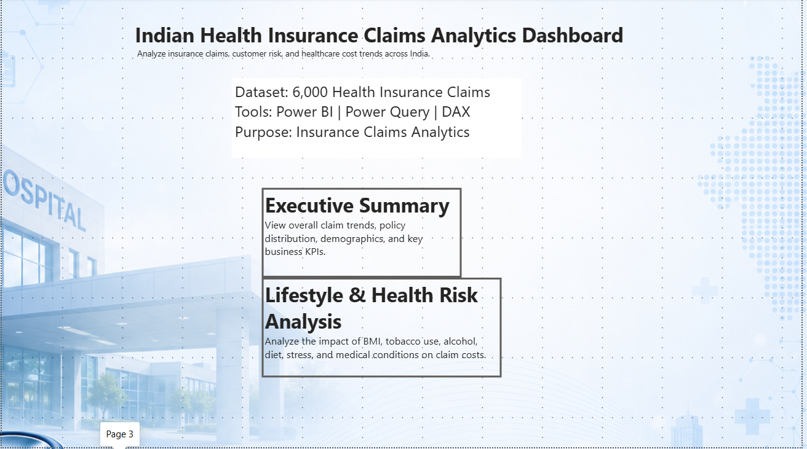
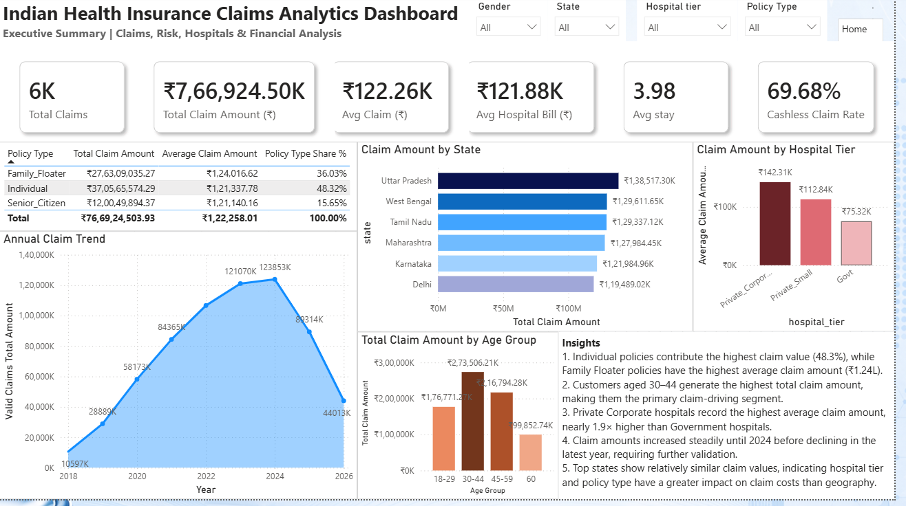
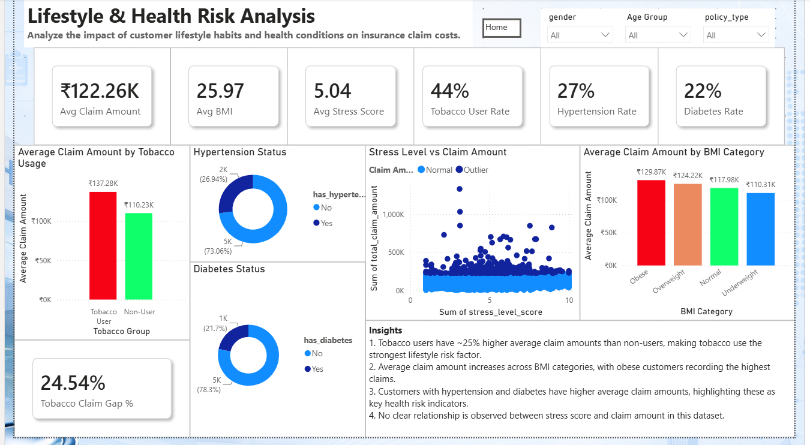

# 🏥 Indian Health Insurance Claims Analytics Dashboard

A comprehensive **Power BI Business Intelligence Dashboard** built using **6,000+ Indian Health Insurance Claims** to analyze claim trends, customer health risks, hospital performance, and insurance policy insights. The dashboard transforms raw insurance data into interactive visualizations and actionable business insights to support data-driven decision-making.

---

## 📌 Project Overview

The healthcare insurance industry generates massive volumes of claim data every day. This project focuses on transforming raw health insurance claim records into meaningful insights using **Power BI**, **Power Query**, and **DAX**.

The dashboard helps answer key business questions such as:

- Which policy type generates the highest claim value?
- Which customer segments contribute the most to claim costs?
- How do lifestyle habits affect insurance claims?
- Which hospitals incur the highest treatment costs?
- What health conditions are associated with higher claims?

---

# 🎯 Objectives

- Analyze overall insurance claim performance.
- Identify high-risk customer segments.
- Study the impact of lifestyle habits on claim costs.
- Compare policy performance.
- Analyze hospital-wise treatment costs.
- Build an interactive executive dashboard for business users.

---

# 🛠️ Tech Stack

- **Power BI Desktop**
- **Power Query**
- **DAX**
- **Microsoft Excel**

---

# 📂 Dataset Information

**Dataset:** Indian Health Insurance Claims

**Total Records:** 6,000+

### Dataset includes:

- Customer Demographics
- Gender
- Age
- State
- Policy Type
- Claim Amount
- Hospital Bill
- Hospital Tier
- Cashless Claim
- Length of Stay
- BMI
- Tobacco Usage
- Diabetes
- Hypertension
- Alcohol Consumption
- Diet Type
- Stress Level

---

# 📊 Dashboard Structure

## 🏠 Home Page

A clean landing page that allows users to navigate to different dashboard sections.

### Features

- Dashboard overview
- Dataset information
- Technology used
- Interactive page navigation

---

## 📈 Page 1 — Executive Summary

Provides an overall business overview of insurance claims.

### KPI Cards

- Total Claims
- Total Claim Amount
- Average Claim Amount
- Average Hospital Bill
- Average Length of Stay
- Cashless Claim Rate

### Visualizations

- Annual Claim Trend
- Claim Amount by State
- Claim Amount by Hospital Tier
- Policy Performance Summary
- Claim Amount by Age Group
- Executive Business Insights

### Key Insights

- Individual policies contribute **48.3%** of total claim value.
- Family Floater policies have the highest average claim amount.
- Customers aged **30–44** generate the highest total claim value.
- Private Corporate hospitals have the highest average claim amounts.
- Geography has less impact on claim costs than hospital tier or policy type.

---

## ❤️ Page 2 — Lifestyle & Health Risk Analysis

Analyzes how lifestyle habits and health conditions influence insurance claim costs.

### KPI Cards

- Average Claim Amount
- Average BMI
- Average Stress Score
- Tobacco User Rate
- Hypertension Rate
- Diabetes Rate
- Tobacco Claim Gap %

### Visualizations

- Average Claim Amount by Tobacco Usage
- Average Claim Amount by BMI Category
- Hypertension Status
- Diabetes Status
- Stress Score vs Claim Amount
- Executive Business Insights

### Key Insights

- Tobacco users have approximately **25% higher average claim amounts** than non-users.
- Average claim amount increases across BMI categories, with obese customers recording the highest claims.
- Customers with hypertension and diabetes have higher average claim amounts.
- No significant relationship exists between stress score and insurance claim amount.

---

# 📈 Business Insights

### Policy Analysis

- Individual policies contribute nearly half of total claim value.
- Family Floater policies have the highest average claim cost.

### Customer Analysis

- Customers aged 30–44 represent the largest claim-driving segment.

### Hospital Analysis

- Private Corporate hospitals generate significantly higher treatment costs than Government hospitals.

### Lifestyle Analysis

- Tobacco usage is the strongest lifestyle-related risk factor.
- Higher BMI categories are associated with higher average claim amounts.

### Health Risk Analysis

- Diabetes and hypertension are associated with higher insurance claim amounts.

---

# 📌 Dashboard Features

- Interactive Filters
- Dynamic KPI Cards
- Multi-page Navigation
- Executive Summary
- Health Risk Analysis
- Responsive Dashboard Layout
- Business Insight Panels
- Professional Healthcare Theme

---

# 📷 Dashboard Preview

## 🏠 Home Page

---

## 📊 Executive Summary

---

## ❤️ Lifestyle & Health Risk Analysis

---

# 💡 Skills Demonstrated

- Power BI Dashboard Development
- Data Cleaning
- Data Transformation
- Power Query
- DAX Measures
- Data Modeling
- KPI Design
- Business Intelligence
- Interactive Dashboard Design
- Data Visualization
- Business Storytelling
- Healthcare Analytics

---

# 🚀 Business Value

This dashboard enables insurance companies to:

- Monitor insurance claim trends
- Identify high-risk customer groups
- Improve underwriting decisions
- Optimize healthcare costs
- Evaluate policy performance
- Support strategic business decisions through data

---

# 📬 Contact

**Kritika Kumari**

- **LinkedIn:** https://linkedin.com/in/kritika-kumari-147153266
- **GitHub:** https://github.com/Kritika-kr

---

## ⭐ If you found this project useful, consider giving it a star!